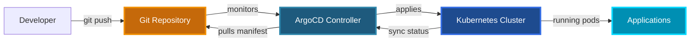
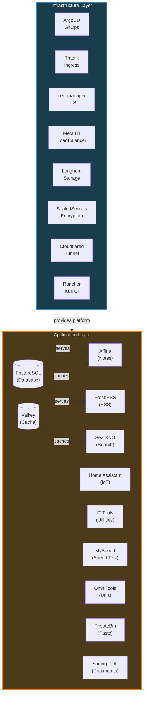

# Enterprise-Grade Kubernetes Homelab

<!-- markdownlint-disable MD013 -->

[](LICENSE)
[](https://kubernetes.io/)
[](https://argo-cd.readthedocs.io/)
[](https://helm.sh/)
[](https://traefik.io/)
[](https://www.postgresql.org/)
[](https://go.dev/)
[](https://cert-manager.io/)
[](https://longhorn.io/)
[](#-key-achievements)

<!-- markdownlint-enable MD013 -->

---

## 📖 About This Project

A production-ready Kubernetes homelab infrastructure demonstrating enterprise
GitOps practices, infrastructure-as-code, and cloud-native architecture
patterns. This repository showcases a complete self-healing platform running
11 applications across 10 infrastructure components, all managed declaratively
through Git.

**Built from scratch** to demonstrate proficiency in:

- Kubernetes cluster management and operations
- GitOps workflows with ArgoCD
- Infrastructure automation and IaC principles
- Custom tooling development (Go-based secret management)
- Security best practices (SealedSecrets, TLS, RBAC)
- Cloud-native application deployment patterns

> **Portfolio Note**: This is a sanitized public version of my personal
> homelab infrastructure, published to demonstrate technical capabilities and
> architectural decision-making for potential employers.

---

## 📊 By the Numbers

```text
📦 11 Active Applications         🏗️ 10 Infrastructure Components
🔄 100% GitOps Coverage           🔐 Zero Plain-Text Secrets
🚀 Zero Manual Deployments        📝 100% Infrastructure-as-Code
🔧 Custom Go Tooling              ⚡ Self-Healing Architecture
```

---

## 🏆 Key Achievements

> **Highlights of technical accomplishments in this project**

- **🎯 Automatic Application Discovery** — Implemented Git directory-based
  auto-discovery using ArgoCD ApplicationSets. Adding a new app requires
  zero configuration edits—just create a directory and commit.

- **🔐 Custom Secret Management** — Developed `kryptos`, a Go-based
  interactive CLI tool replacing legacy bash scripts. Features secure password
  generation, YAML-driven configuration, and streamlined SealedSecrets
  workflow.

- **📦 Custom Helm Chart Repository** — Built and maintain OCI-compliant Helm
  chart registry for standardized application deployment across the platform.

- **🛡️ Zero-Trust Security** — All secrets encrypted at rest with Sealed
  Secrets, automatic TLS certificate management via cert-manager, and complete
  GitOps audit trail.

- **🏗️ App-of-Apps Architecture** — Self-managing ArgoCD deployment
  bootstraps entire infrastructure from a single root manifest, demonstrating
  advanced GitOps patterns.

- **🔄 Self-Healing Infrastructure** — Kubernetes-native health checks,
  automatic failover, and declarative state management ensure platform
  reliability without manual intervention.

---

## 🗺️ Architecture Overview

### GitOps Deployment Flow

<!-- markdownlint-disable MD040 -->



<!-- markdownlint-enable MD040 -->

### Platform Architecture

<!-- markdownlint-disable MD040 -->



<!-- markdownlint-enable MD040 -->

---

## 🚀 Quick Start

### Bootstrap the Entire Stack

```bash
# Clone the repository
git clone <your-repo-url>
cd argo-apps

# Bootstrap ArgoCD and all infrastructure
kubectl apply -f bootstrap/root.yaml

# Monitor deployment (ArgoCD UI will be available once ready)
kubectl get applications -n argocd -w
```

### Access ArgoCD UI

```bash
# Get initial admin password
kubectl -n argocd get secret argocd-initial-admin-secret \
  -o jsonpath="{.data.password}" | base64 -d && echo

# Port-forward to access UI
kubectl port-forward svc/argocd-server -n argocd 8080:443

# Open https://localhost:8080
```

### Sync Applications

> **Note**: Auto-sync is intentionally disabled for controlled deployments.

```bash
# Sync a specific application
argocd app sync <app-name>

# Sync all applications
argocd app sync -l argocd.argoproj.io/instance=apps

# Watch sync progress
kubectl get applications -n argocd -w
```

---

## 📋 Applications & Infrastructure

### Infrastructure Components (10)

| Component             | Namespace         | Purpose                          |
| --------------------- | ----------------- | -------------------------------- |
| **ArgoCD**            | `argocd`          | GitOps controller and CD         |
| **Traefik**           | `traefik`         | Ingress controller & routing     |
| **cert-manager**      | `cert-manager`    | Automatic TLS certificates       |
| **MetalLB**           | `metallb-system`  | L2 load balancer                 |
| **Longhorn**          | `longhorn-system` | Distributed block storage        |
| **SealedSecrets**     | `kube-system`     | Secret encryption                |
| **Cloudflared**       | `cloudflared`     | Secure tunnel access             |
| **Rancher**           | `cattle-system`   | Kubernetes management UI         |
| **External Services** | `traefik`         | External service proxies         |
| **Monitoring**        | `monitoring`      | Prometheus & Grafana *(planned)* |

### Active Applications (11)

<!-- markdownlint-disable MD013 -->

| Application        | Category     | Technology             | Chart Source      |
| ------------------ | ------------ | ---------------------- | ----------------- |
| **Affine**         | Productivity | AI-powered notes       | Custom Helm (OCI) |
| **FreshRSS**       | Productivity | RSS aggregator         | Custom Helm (OCI) |
| **Home Assistant** | Smart Home   | IoT platform           | Custom Helm (OCI) |
| **IT Tools**       | DevTools     | Developer utilities    | Custom Helm (OCI) |
| **MySpeed**        | Monitoring   | Speed testing          | Custom Helm (OCI) |
| **Omni Tools**     | DevTools     | General utilities      | Custom Helm (OCI) |
| **PostgreSQL**     | Data         | Shared DB cluster      | Bitnami Helm      |
| **PrivateBin**     | DevTools     | Encrypted pastebin     | Custom Helm (OCI) |
| **SearXNG**        | DevTools     | Privacy search         | Custom Helm (OCI) |
| **Stirling-PDF**   | DevTools     | PDF manipulation       | Custom Helm (OCI) |
| **Valkey**         | Data         | Redis-compatible cache | Bitnami Helm      |

<!-- markdownlint-enable MD013 -->

---

## 🎯 Automatic Application Discovery

### How It Works

The platform uses ArgoCD's **Git directory generator** to automatically
discover applications:

```text
# argocd/applications/apps-set.yaml
apiVersion: argoproj.io/v1alpha1
kind: ApplicationSet
spec:
  generators:
    - git:
        directories:
          - path: apps/* # Auto-discovers all subdirectories!
  template:
    metadata:
      name: "{{.path.basename}}"
    spec:
      destination:
        namespace: "{{.path.basename}}" # Namespace = directory name
```

### Benefits

✅ **Zero Configuration** — No manual ApplicationSet edits required
✅ **Automatic Namespaces** — Namespace matches directory name
✅ **Error Reduction** — Eliminates typos from manual lists
✅ **Faster Onboarding** — Add directory → commit → sync → done
✅ **Git as Truth** — Directory existence = deployment intent

---

## 🔐 Security & Secrets

### Secret Management with Kryptos

All secrets are managed using **Kryptos**, a custom Go-based CLI tool:

```bash
# Interactive TUI for secret generation
cd scripts/kryptos
./kryptos

# Features:
# - Secure password generation (secure/strong/apikey/passphrase)
# - YAML-driven app configuration
# - Automated SealedSecret creation
# - Built-in validation
```

### Security Principles

🛡️ **Never commit plain-text secrets** — All secrets encrypted with Sealed
Secrets
🔐 **TLS Everywhere** — Automatic wildcard certificates via cert-manager
📝 **Complete Audit Trail** — Every change tracked in Git
🔑 **Principle of Least Privilege** — RBAC enforced across all components

---

## 📁 Repository Structure

```text
argo-apps/
├── apps/                            # Applications (auto-discovered)
│   ├── affine/                      # AI note-taking
│   ├── freshrss/                    # RSS aggregator
│   ├── home-assistant/              # Home automation
│   ├── it-tools/                    # Developer utilities
│   ├── myspeed/                     # Speed testing
│   ├── omni-tools/                  # General utilities
│   ├── postgresql/                  # Shared database
│   ├── privatebin/                  # Encrypted pastebin
│   ├── searxng/                     # Privacy search
│   ├── stirling-pdf/                # PDF tools
│   └── valkey/                      # Cache/sessions
│
├── infrastructure/                  # Platform components
│   ├── argocd/                      # ArgoCD deployment
│   ├── traefik/                     # Ingress controller
│   ├── cert-manager/                # Certificate management
│   ├── metallb/                     # Load balancer
│   ├── longhorn/                    # Storage
│   ├── monitoring/                  # Prometheus & Grafana
│   ├── cloudflared/                 # Cloudflare tunnel
│   ├── external-services/           # External proxies
│   ├── sealed-secrets/              # Secret encryption
│   └── rancher/                     # K8s management
│
├── argocd/                          # ArgoCD manifests
│   ├── infrastructure/              # Infrastructure apps
│   └── applications/                # Application ApplicationSet
│       └── apps-set.yaml            # Git directory generator
│
├── scripts/                         # Tooling
│   ├── ci/                          # CI/CD scripts
│   └── kryptos/                     # Secret management (Go)
│
├── bootstrap/                       # Bootstrap config
│   ├── root.yaml                    # Root Application
│   └── install-argocd.sh            # ArgoCD installer
│
└── docs/                            # Documentation
    ├── APPLICATION_DEVELOPMENT.md   # Guide for developing applications
    ├── ARCHITECTURE.md              # Architecture details
    ├── CI-CD-PIPELINE.md            # CI/CD pipeline configuration and usage
    ├── DETAILED_GUIDE.md            # Complete technical guide
    ├── NAMING_CONVENTIONS.md        # Naming standards and conventions
    ├── QUICK_REFERENCE.md           # Quick reference cheat sheet
    ├── RENOVATE-TROUBLESHOOTING.md  # Renovate dependency update troubleshooting
    ├── SECURITY.md                  # Security practices
    └── TROUBLESHOOTING.md           # Common issues
```

---

## 🛠️ Technology Stack

### Core Platform

- **Kubernetes** — Container orchestration (v1.34+)
- **ArgoCD** — GitOps continuous delivery
- **Helm** — Package management
- **Kustomize** — Configuration management
- **Go** — Custom tooling (kryptos)

### Infrastructure

- **Traefik** — Ingress controller & edge router
- **cert-manager** — Automated TLS with Let's Encrypt
- **MetalLB** — Bare-metal load balancing
- **Longhorn** — Distributed block storage
- **Sealed Secrets** — Encrypted secret management

### Data Layer

- **PostgreSQL** — Shared relational database (Bitnami)
- **Valkey** — Redis-compatible cache/session store

### Monitoring (Planned)

- **Prometheus** — Metrics collection
- **Grafana** — Visualization & dashboards

---

## 📚 Documentation

- **[Detailed Technical Guide](docs/DETAILED_GUIDE.md)** — Complete
  deployment, maintenance, and troubleshooting
- **[Architecture Deep-Dive](docs/ARCHITECTURE.md)** — System design and
  component relationships
- **[Application Development](docs/APPLICATION_DEVELOPMENT.md)** — Adding and
  managing applications
- **[Security Practices](docs/SECURITY.md)** — Secret management and security
  patterns
- **[Quick Reference](docs/QUICK_REFERENCE.md)** — Common commands and
  workflows
- **[Troubleshooting](docs/TROUBLESHOOTING.md)** — Solutions to common issues

---

## 🤝 Contributing

Contributions are welcome! This project demonstrates GitOps best practices
and cloud-native patterns. Please see [CONTRIBUTING.md](CONTRIBUTING.md) for
guidelines.

---

## 📄 License

This project is licensed under the MIT License - see the [LICENSE](LICENSE)
file for details.

---

## 🎓 Learning & Portfolio

This repository showcases:

- **GitOps Expertise** — Complete infrastructure managed declaratively
  through Git
- **Kubernetes Proficiency** — Advanced cluster management, RBAC, networking,
  storage
- **Security Practices** — Sealed Secrets, TLS automation, audit trails
- **Custom Tooling** — Go-based secret management CLI (kryptos)
- **IaC Patterns** — Infrastructure-as-code across all components
- **Cloud-Native Architecture** — Microservices, self-healing, observability
- **Documentation** — Comprehensive technical documentation and runbooks

Built with ❤️ for learning, demonstration, and continuous improvement.

---

**Questions?** Open an issue or check the [documentation](docs/).
