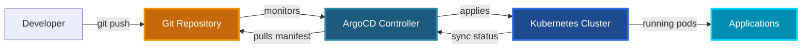

# Enterprise-Grade Kubernetes Homelab

<!-- markdownlint-disable MD013 -->

[](LICENSE)
[](https://kubernetes.io/)
[](https://argo-cd.readthedocs.io/)
[](https://helm.sh/)
[](https://traefik.io/)
[](https://cert-manager.io/)
[](https://longhorn.io/)
[](https://www.postgresql.org/)
[](https://go.dev/)
[](#-key-achievements)
[](#-cicd-infrastructure)

<!-- markdownlint-enable MD013 -->

---

## 📖 About This Project

A production-ready Kubernetes homelab infrastructure demonstrating enterprise
GitOps practices, infrastructure-as-code, and cloud-native architecture
patterns. This repository showcases a complete self-healing platform running
26 applications across four tiers (infra, data, services, user), all managed
declaratively through Git.

**Built from scratch** to demonstrate proficiency in:

- Kubernetes cluster management and operations
- GitOps workflows with ArgoCD
- Infrastructure automation and IaC principles
- Custom tooling development (Go-based secret management)
- Security best practices (SealedSecrets, TLS, RBAC)
- Cloud-native application deployment patterns

> **Portfolio Note**: This is a sanitized public version of a personal
> homelab infrastructure, published to demonstrate technical capabilities
> and architectural decision-making for potential employers.

---

## 📊 By the Numbers

```text
📦 26 Applications (4 tiers)      🏗️ Unified ApplicationSet
🔄 100% GitOps Coverage           🔐 Zero Plain-Text Secrets
🚀 Zero Manual Deployments        📝 100% Infrastructure-as-Code
🔧 Custom Go Tooling              ⚡ Self-Healing Architecture
🔒 SSO via Authentik (ForwardAuth)  🚀 CI/CD on GitLab CI
```

---

## 🏆 Key Achievements

> **Highlights of technical accomplishments in this project**

- **🎯 Declarative Application Discovery** — A single ArgoCD ApplicationSet
  uses a Git **files generator** (`apps/*/*/config.yaml`) to generate every
  Application. Each app declares its own namespace, sync wave, and sync
  policy in a `config.yaml`; adding an app means adding a directory with a
  `config.yaml` and committing.

- **🔐 Custom Secret Management** — Developed `kryptos`, a Go-based
  interactive CLI tool replacing legacy bash scripts. Features secure password
  generation, YAML-driven configuration, and streamlined SealedSecrets
  workflow.

- **📦 Custom Helm Chart Repository** — Built and maintain OCI-compliant Helm
  chart registry for standardized application deployment across the platform.

- **🛡️ Zero-Trust Security** — All secrets encrypted at rest with Sealed
  Secrets, automatic TLS certificate management via cert-manager, and complete
  GitOps audit trail.

- **🏗️ App-of-Apps Architecture** — Self-managing ArgoCD deployment
  bootstraps entire infrastructure from a single root manifest, demonstrating
  advanced GitOps patterns.

- **🔄 Self-Healing Infrastructure** — Kubernetes-native health checks,
  automatic failover, and declarative state management ensure platform
  reliability without manual intervention.

- **🔒 SSO Integration** — Centralized authentication via Authentik: the SSO
  portal, the Traefik ForwardAuth provider (embedded outpost) for protected
  routes, and the OIDC provider behind per-user Kubernetes RBAC in Headlamp.

- **🚀 GitLab CI** — Native per-repo pipelines on a self-hosted runner.
  Fail-fast, change-gated jobs (scan, lint, validate, build); artifacts
  (CI images, Helm charts) are signed with cosign and published to Harbor.

- **📊 Tiered Sync Waves** — Apps are organised into four tiers (infra, data,
  services, user) with sync-wave bands (infra -1..3, data 4, services 5,
  user 6) so dependencies come up in the correct order. A three-tier priority
  class system optimises scheduling across stateful and stateless services.

---

## 🗺️ Architecture Overview

### GitOps Deployment Flow

<!-- markdownlint-disable MD040 -->


```mermaid
flowchart LR
    Dev[Developer] -->|git push| GitRepo[Git Repository]
    GitRepo -->|monitors| ArgoCD[ArgoCD Controller]
    ArgoCD -->|pulls manifest| GitRepo
    ArgoCD -->|applies| K8s[Kubernetes Cluster]
    K8s -->|sync status| ArgoCD
    K8s -->|running pods| Apps[Applications]

    style ArgoCD fill:#1e5a7d,stroke:#2E86AB,stroke-width:3px,color:#fff
    style GitRepo fill:#c5690a,stroke:#F18F01,stroke-width:3px,color:#fff
    style K8s fill:#1e4b8f,stroke:#326CE5,stroke-width:3px,color:#fff
    style Apps fill:#008fb3,stroke:#00D9FF,stroke-width:3px,color:#fff
```

<!-- markdownlint-enable MD040 -->

### Platform Architecture

<!-- markdownlint-disable MD040 -->


```mermaid
flowchart TB
    subgraph Infra["Infra Tier (waves -1..3)"]
        direction LR
        ArgoCD[ArgoCD<br/>GitOps]
        Traefik[Traefik<br/>Ingress]
        Authentik[Authentik<br/>SSO + ForwardAuth + OIDC]
        CertMgr[cert-manager<br/>TLS]
        CfDDNS[Cloudflare DDNS<br/>DNS Updates]
        Cloudflared[Cloudflared<br/>Tunnel]
        Longhorn[Longhorn<br/>Storage]
        MetalLB[MetalLB<br/>LoadBalancer]
        MetricsSvr[Metrics Server<br/>Resources]
        Priority[Priority Classes<br/>Scheduling]
        SealedSec[SealedSecrets<br/>Encryption]
        ExternalSvc[External Services<br/>Proxies]
    end

    subgraph Data["Data Tier (wave 4)"]
        direction LR
        PostgreSQL[("PostgreSQL<br/>Database")]
        Valkey[("Valkey<br/>Cache")]
    end

    subgraph Services["Services Tier (wave 5)"]
        direction LR
        Harbor["Harbor<br/>OCI Registry"]
        Headlamp["Headlamp<br/>K8s UI"]
    end

    subgraph User["User Tier (wave 6)"]
        direction LR
        DocuSeal["DocuSeal<br/>Documents"]
        Joplin["Joplin<br/>Notes"]
        LiteLLM["LiteLLM<br/>LLM Proxy"]
        Memos["Memos<br/>Notes"]
        OneTimeSecret["OneTimeSecret<br/>Secret Links"]
        OpenWebUI["Open WebUI<br/>AI Chat UI"]
        PrivateBin["PrivateBin<br/>Paste"]
        SearXNG["SearXNG<br/>Search"]
        SnapOtter["SnapOtter<br/>File Processing"]
        StirlingPDF["Stirling-PDF<br/>PDF Tools"]
    end

    Traefik -->|forwardAuth| Authentik
    Authentik -.->|protects| Services
    Authentik -.->|protects| User
    PostgreSQL -->|serves| Harbor
    PostgreSQL -->|serves| DocuSeal
    PostgreSQL -->|serves| Joplin
    PostgreSQL -->|serves| LiteLLM
    PostgreSQL -->|serves| Memos
    PostgreSQL -->|serves| SnapOtter
    PostgreSQL -->|serves| Authentik
    Valkey -->|caches| SearXNG
    Valkey -->|stores| SnapOtter
    Valkey -->|stores| OneTimeSecret
    OpenWebUI -->|chats via| LiteLLM

    style Infra fill:#1a3d4d,stroke:#2E86AB,stroke-width:3px,color:#fff
    style Data fill:#1a4d3a,stroke:#2EAB6A,stroke-width:3px,color:#fff
    style Services fill:#4d1a3d,stroke:#AB2E86,stroke-width:3px,color:#fff
    style User fill:#4d3a1a,stroke:#F18F01,stroke-width:3px,color:#fff
```

<!-- markdownlint-enable MD040 -->

---

## 🚀 Quick Start

### Bootstrap the Entire Stack

```bash
# Clone the repository
git clone <your-repo-url>
cd argo-apps

# Bootstrap ArgoCD and all infrastructure
kubectl apply -f argocd/root.yaml

# Monitor deployment (ArgoCD UI will be available once ready)
kubectl get applications -n argocd -w
```

### Access ArgoCD UI

```bash
# Get initial admin password
kubectl -n argocd get secret argocd-initial-admin-secret \
  -o jsonpath="{.data.password}" | base64 -d && echo

# Port-forward to access UI
kubectl port-forward svc/argocd-server -n argocd 8080:443

# Open https://localhost:8080
```

### Sync Applications

> **Note**: Auto-sync is intentionally disabled for controlled deployments.

```bash
# Sync a specific application
argocd app sync <app-name>

# Sync all applications
argocd app sync -l argocd.argoproj.io/instance=apps

# Watch sync progress
kubectl get applications -n argocd -w
```

---

## 📋 Applications by Tier (26)

Every app lives under `apps/<tier>/<name>/` and is generated by the single
ApplicationSet from its `config.yaml`. Tiers map to sync-wave bands so
dependencies come up in order.

### Infra Tier — `apps/infra/` (waves -1..3)

<!-- markdownlint-disable MD013 -->

| Application           | Namespace         | Purpose                               |
| --------------------- | ----------------- | ------------------------------------- |
| **ArgoCD**            | `argocd`          | GitOps controller (self-managing)     |
| **Authentik**         | `authentik`       | SSO portal, ForwardAuth, OIDC         |
| **cert-manager**      | `cert-manager`    | Automatic TLS certificates            |
| **Cloudflare DDNS**   | `cloudflare-ddns` | Keeps DNS pointed at the public IP    |
| **Cloudflared**       | `cloudflared`     | Secure Cloudflare tunnel access       |
| **External Services** | `traefik`         | External service proxies              |
| **Longhorn**          | `longhorn-system` | Distributed block storage             |
| **MetalLB**           | `metallb-system`  | L2 load balancer                      |
| **Metrics Server**    | `kube-system`     | Resource metrics for pods/nodes       |
| **Priority Classes**  | `cluster-wide`    | Resource scheduling & priorities      |
| **SealedSecrets**     | `kube-system`     | Secret encryption                     |
| **Traefik**           | `traefik`         | Ingress controller & routing          |

<!-- markdownlint-enable MD013 -->

### Data Tier — `apps/data/` (wave 4)

<!-- markdownlint-disable MD013 -->

| Application    | Technology             | Chart Source |
| -------------- | ---------------------- | ------------ |
| **PostgreSQL** | Shared DB cluster      | Custom OCI   |
| **Valkey**     | Redis-compatible cache | Custom OCI   |

<!-- markdownlint-enable MD013 -->

### Services Tier — `apps/services/` (wave 5)

<!-- markdownlint-disable MD013 -->

| Application        | Technology                   | Notes                  |
| ------------------ | ---------------------------- | ---------------------- |
| **Harbor**         | OCI registry                 | Uses shared PostgreSQL |
| **Headlamp**       | Kubernetes management UI     | Cluster dashboard      |

<!-- markdownlint-enable MD013 -->

### User Tier — `apps/user/` (wave 6)

<!-- markdownlint-disable MD013 -->

| Application       | Category     | Technology                               | Chart Source      |
| ----------------- | ------------ | ---------------------------------------- | ----------------- |
| **DocuSeal**      | Productivity | Document signing                         | Custom Helm (OCI) |
| **Joplin**        | Productivity | Note-taking server                       | Custom Helm (OCI) |
| **LiteLLM**       | AI Gateway   | LLM proxy & gateway                      | Custom Helm (OCI) |
| **Memos**         | Productivity | Quick-note memos                         | Custom Helm (OCI) |
| **OneTimeSecret** | DevTools     | View-once secret links                   | Custom Helm (OCI) |
| **Open WebUI**    | AI Gateway   | Multi-model chat UI                      | Custom Helm (OCI) |
| **PrivateBin**    | DevTools     | Encrypted pastebin                       | Custom Helm (OCI) |
| **SearXNG**       | DevTools     | Privacy search                           | Custom Helm (OCI) |
| **SnapOtter**     | Productivity | File processing (image/video/audio/PDF)  | Custom Helm (OCI) |
| **Stirling-PDF**  | Productivity | Self-hosted PDF toolset                  | Custom Helm (OCI) |

<!-- markdownlint-enable MD013 -->

---

## 🎯 Declarative Application Generation

### How It Works

A single ArgoCD ApplicationSet at `argocd/apps-set.yaml` uses a Git **files
generator** to generate every Application from a per-app `config.yaml`:

```text
# argocd/apps-set.yaml
apiVersion: argoproj.io/v1alpha1
kind: ApplicationSet
spec:
  generators:
    - git:
        files:
          - path: apps/*/*/config.yaml # One config.yaml per app
```

Each `apps/<tier>/<name>/config.yaml` declares the app's deployment metadata:

```text
namespace: harbor          # omit → cluster-scoped; default = directory name
syncWave: "5"              # string; infra -1..3, data 4, services 5, user 6
autoSync: false            # true → automated prune + selfHeal
createNamespace: true      # true → CreateNamespace=true sync option
serverSideApply: false     # true → ServerSideApply=true sync option
ignoreDifferences: []      # optional ArgoCD ignoreDifferences block
```

> **Critical**: No `config.yaml` ⇒ no Application generated. A directory
> without one will not sync and will not be pruned.

### Benefits

✅ **Single Source of Truth** — One ApplicationSet generates every app
✅ **Per-App Policy** — Namespace, sync wave, and sync behaviour declared in
each app's `config.yaml` and applied by the ApplicationSet's templatePatch
(no central allowlist)
✅ **Ordered Rollout** — Tier-based sync waves bring dependencies up in order
✅ **Explicit Intent** — `config.yaml` presence = deployment intent
✅ **Faster Onboarding** — Add `apps/<tier>/<name>/config.yaml` → commit → sync

---

## 🔒 Authentication & Authorization

### SSO Architecture with Authentik

The platform implements centralized identity using **Authentik**
(`apps/infra/authentik`), which is simultaneously the SSO portal
(`auth.example.com`), the Traefik ForwardAuth provider (via its embedded
outpost), and the OIDC provider used by Headlamp:

```text
┌─────────────┐      ┌──────────────┐      ┌──────────────────────┐
│   Browser   │─────▶│   Traefik    │─────▶│  Authentik outpost   │
│             │◀─────│  (Ingress)   │◀─────│  (ForwardAuth + OIDC)│
└─────────────┘      └──────────────┘      └──────────────────────┘
                            │                      │
                            ▼                      │
                     ┌──────────────┐              │
                     │ Application  │◀─────────────┘
                     │  (Protected) │
                     └──────────────┘
```

Traefik forwards authentication for protected `*.example.com` routes to the
single `authentik-forwardauth` middleware in the `authentik` namespace,
backed by the embedded outpost at `/outpost.goauthentik.io/auth/traefik`.
A successful login establishes a session shared across protected apps.

### Protecting an Application

Reference the `authentik-forwardauth` middleware (in the `authentik`
namespace) on the application's IngressRoute, add a matching proxy provider,
application, and `admins` group binding to the declarative blueprints in
`apps/infra/authentik/blueprints/`, and forward the app's
`/outpost.goauthentik.io/` path to `authentik-server`. A host with no
application in the outpost fails closed (404).

### Authentication Flow

1. **User Access** — User navigates to a protected application
2. **ForwardAuth Check** — Traefik forwards the request to the embedded
   outpost
3. **Session Validation** — The outpost checks for a valid Authentik session
4. **Portal Redirect** — If unauthenticated, the outpost redirects to the
   portal at `auth.example.com`
5. **Authentication** — User authenticates (MFA enforced flow-wide)
6. **Application Access** — On success, the `admins` binding is evaluated and
   the request proceeds to the app

### Key Features

✅ **Single Sign-On** — Portal, ForwardAuth, and OIDC in one component
✅ **Reusable Middleware** — One shared ForwardAuth middleware gates any
IngressRoute
✅ **Deny by Default** — Per-application `admins` group bindings; a host with
no application gets a 404 from the outpost
✅ **Kubernetes RBAC** — Headlamp uses Authentik's OIDC client, and the Talos
apiserver trusts `https://auth.example.com/application/o/headlamp/` as its
sole OIDC issuer
✅ **Database-Backed** — PostgreSQL-only backend on the shared cluster (no
Redis/Valkey)

---

## 🚀 CI/CD Infrastructure

### GitLab CI

Native GitLab CI — one `.gitlab-ci.yml` per repo, executed by a self-hosted
runner. Running CI off-cluster keeps the cluster's RAM and storage for
workloads rather than per-run pipeline pods.

**Architecture:**

```text
┌─────────────┐    ┌──────────────────┐    ┌──────────────────┐
│   GitLab    │───▶│  GitLab CI       │───▶│  GitLab Runner   │
│  (push/MR/  │    │  (.gitlab-ci.yml │    │  (Docker exec,   │
│   tag)      │    │   per repo)      │    │   own LXC)       │
└─────────────┘    └──────────────────┘    └──────────────────┘
                                                    │
                                                    ▼
                                           ┌──────────────────┐
                                           │  Harbor (OCI)    │
                                           │  signed by cosign│
                                           └──────────────────┘
```

**Features:**

- **Fail-fast, change-gated** — Stages `scan → lint → validate → test →
  image`; `rules:changes` runs only the jobs a change touches (a docs MR
  skips the build)
- **Bypass-proof secret scan** — `scan:secrets` (gitleaks, full history)
  runs server-side on every MR + main push, independent of local hooks
- **Cosign-signed artifacts** — CI images and Helm charts published to
  Harbor with detached signatures (signed by digest, verified offline)
- **Per-app validate fan-out** — argo-apps validates only the changed
  `apps/<tier>/<X>/` directories via kustomize → kubeconform (against a
  CRDs-catalog baked into the CI image; no cluster access)
- **Native commit status** — GitLab reports a green ✓ / red ✗ per pipeline,
  directly (no status-poster sidecar)
- **Scheduled maintenance** — Renovate + the sanitized GitHub mirror run as
  GitLab pipeline schedules

---

## 🔐 Security & Secrets

### Secret Management with Kryptos

All secrets are managed using **Kryptos**, a custom Go-based CLI tool:

```bash
# Interactive TUI for secret generation
kryptos   # released binary, run from the repo root

# Features:
# - Secure password generation (secure/strong/apikey/passphrase)
# - YAML-driven app configuration
# - Automated SealedSecret creation
# - Built-in validation
```

### Security Principles

🛡️ **Never commit plain-text secrets** — All secrets encrypted with Sealed
Secrets
🔐 **TLS Everywhere** — Automatic wildcard certificates via cert-manager
📝 **Complete Audit Trail** — Every change tracked in Git
🔑 **Principle of Least Privilege** — RBAC enforced across all components

---

## 📁 Repository Structure

```text
argo-apps/
├── argocd/                          # ArgoCD control plane / bootstrap
│   ├── root.yaml                    # Root Application (points at argocd/)
│   ├── apps-set.yaml                # ApplicationSet (git files generator)
│   ├── kustomization.yaml           # Control-plane bootstrap
│   └── README.md                    # Bootstrap guide
│
├── apps/                            # All applications (generated by apps-set)
│   ├── infra/                       # Infra tier (waves -1..3)
│   │   ├── argocd/                  # ArgoCD deployment (self-managing)
│   │   ├── authentik/               # SSO portal, ForwardAuth, OIDC
│   │   ├── cert-manager/            # Certificate management
│   │   ├── cloudflare-ddns/         # Cloudflare DNS updates
│   │   ├── cloudflared/             # Cloudflare tunnel
│   │   ├── external-services/       # External proxies
│   │   ├── longhorn/                # Storage
│   │   ├── metallb/                 # Load balancer
│   │   ├── metrics-server/          # Resource metrics
│   │   ├── priority-classes/        # Resource scheduling
│   │   ├── sealed-secrets/          # Secret encryption
│   │   └── traefik/                 # Ingress controller
│   │
│   ├── data/                        # Data tier (wave 4)
│   │   ├── postgresql/              # Shared database
│   │   └── valkey/                  # Cache/sessions
│   │
│   ├── services/                    # Services tier (wave 5)
│   │   ├── harbor/                  # OCI registry
│   │   └── headlamp/                # Kubernetes UI
│   │
│   └── user/                        # User tier (wave 6)
│       ├── docuseal/                # Document signing
│       ├── joplin/                  # Note-taking server
│       ├── litellm/                 # LLM proxy & gateway
│       ├── memos/                   # Quick-note memos
│       ├── onetimesecret/           # View-once secret links
│       ├── open-webui/              # AI chat frontend
│       ├── privatebin/              # Encrypted pastebin
│       ├── searxng/                 # Privacy search
│       ├── snapotter/               # File processing
│       └── stirling-pdf/            # PDF toolset
│
│   # Every app dir contains a config.yaml consumed by the ApplicationSet.
│
├── kryptos/                         # Secret management (Go) — configs
│
├── .ci/                             # CI/CD infrastructure
│   ├── scripts/                     # Python CI/CD scripts
│   ├── docker/                      # Golden CI image
│   └── bootstrap/                   # CI bootstrap material
│
└── docs/                            # Documentation
    ├── README.md                    # Documentation index
    ├── ARCHITECTURE.md              # GitOps patterns & design
    ├── APPLICATIONS.md              # Application catalog
    ├── INFRASTRUCTURE.md            # Infrastructure reference
    ├── OPERATIONS.md                # Day-2 runbook
    ├── CI-CD-PIPELINE.md            # Pipeline documentation
    ├── SECURITY.md                  # Security & secrets guide
    ├── BACKUP-DR.md                 # Backup & disaster recovery
    └── TROUBLESHOOTING.md           # Common issues & fixes
```

---

## 🛠️ Technology Stack

### Core Platform

- **Kubernetes** — Container orchestration (v1.34+)
- **ArgoCD** — GitOps continuous delivery
- **Helm** — Package management
- **Kustomize** — Configuration management
- **Go** — Custom tooling (kryptos)

### Infrastructure

- **Traefik** — Ingress controller & edge router
- **cert-manager** — Automated TLS with Let's Encrypt
- **MetalLB** — Bare-metal load balancing
- **Longhorn** — Distributed block storage
- **Sealed Secrets** — Encrypted secret management
- **Priority Classes** — Workload scheduling & resource prioritization

### Identity & Security

- **Authentik** — SSO portal, Traefik ForwardAuth provider (single
  `authentik-forwardauth` middleware backed by the embedded outpost), and
  OIDC provider for Headlamp

### Data Layer

- **PostgreSQL** — Shared relational database (custom chart, official image)
- **Valkey** — Redis-compatible cache/session store (custom chart, official
  image)

### CI/CD

- **GitLab CI** — native per-repo pipelines (`.gitlab-ci.yml`) with
  fail-fast, change-gated jobs; native commit status
- **GitLab Runner** — self-hosted on its own LXC (Docker executor bound to
  the host socket); builds images with plain `docker build`
- **Harbor** — OCI registry for CI images and Helm charts, with cosign
  signatures for every published artifact

---

## 📚 Documentation

Comprehensive documentation is available in the [`docs/`](docs/) directory
(start at the [docs index](docs/README.md)):

- **[Architecture](docs/ARCHITECTURE.md)** — GitOps patterns, sync waves,
  bootstrap process
- **[Applications](docs/APPLICATIONS.md)** — Application catalog and
  deployment guides
- **[Infrastructure](docs/INFRASTRUCTURE.md)** — Platform components and
  external services
- **[Operations](docs/OPERATIONS.md)** — Day-2 runbook: sync, validate,
  inspect, rotate
- **[CI/CD Pipeline](docs/CI-CD-PIPELINE.md)** — GitLab CI stages, the CI
  image, cosign signing, validation
- **[Security](docs/SECURITY.md)** — Secret management, SSO, TLS certificates
- **[Backup & DR](docs/BACKUP-DR.md)** — What GitOps recreates vs. what
  needs data recovery
- **[Troubleshooting](docs/TROUBLESHOOTING.md)** — Common issues and
  diagnostic commands

---

## 🤝 Contributing

Contributions are welcome! This project demonstrates GitOps best practices
and cloud-native patterns. Please see [CONTRIBUTING.md](CONTRIBUTING.md) for
guidelines.

---

## 📄 License

This project is licensed under the MIT License - see the [LICENSE](LICENSE)
file for details.

---

## 🎓 Learning & Portfolio

This repository showcases:

- **GitOps Expertise** — Complete infrastructure managed declaratively
  through Git
- **Kubernetes Proficiency** — Advanced cluster management, RBAC, networking,
  storage, workload scheduling
- **Security Practices** — Sealed Secrets, TLS automation, audit trails, SSO
  integration
- **Identity & Access Management** — SSO via Authentik: portal, Traefik
  ForwardAuth with per-application access control (deny by default), and an
  OIDC provider issuing tokens the Talos apiserver validates for per-user
  Headlamp RBAC via structured `AuthenticationConfiguration`
- **CI/CD Implementation** — Native GitLab CI pipelines on a self-hosted
  runner, with cosign-signed publishing to Harbor
- **Custom Tooling** — Go-based secret management CLI (kryptos)
- **IaC Patterns** — Infrastructure-as-code across all components
- **Cloud-Native Architecture** — Microservices, self-healing, observability,
  priority-based scheduling
- **Storage Solutions** — Distributed block storage (Longhorn)
- **Documentation** — Comprehensive technical documentation and runbooks

Built with ❤️ for learning, demonstration, and continuous improvement.

---

**Questions?** Open an issue or check the [documentation](docs/).
